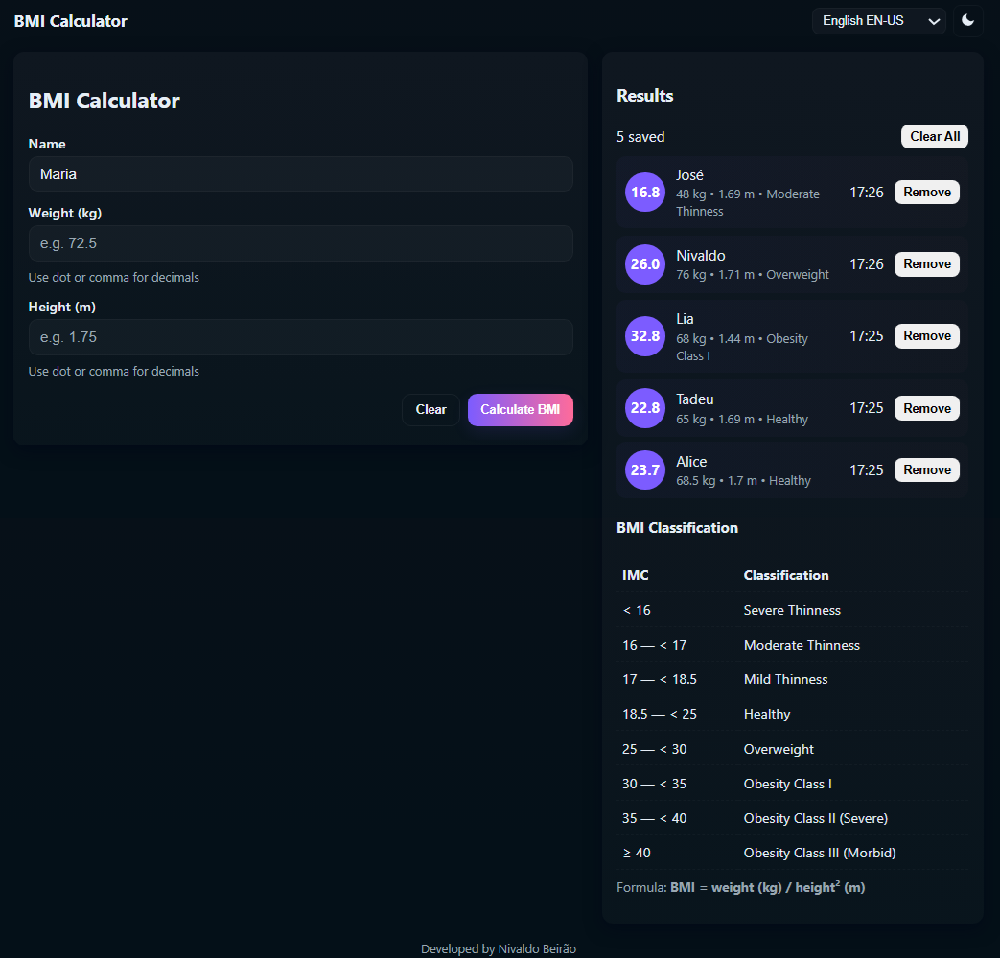

# Enhancing Your BMI Calculator with Flutter

Project developed at Santander Bootcamp 2023 - Mobile with Flutter, under the guidance of specialist [Danilo Perez](https://github.com/perez-danilo "Danilo Perez").

In this challenge, we will make the BMI Calculator even more comprehensive and professional by applying additional concepts and tools, and by updating the app to include data reading and result display in a list format.

## Features

- **Dark-first**: UI with a light mode toggle (moon / sun icons).
- **Multilingual**: English EN-US (default), Português PT-BR, Español ES-ES.
- **Accessible**: semantic HTML, labels, `aria-live` for results, keyboard support.
- **Responsive**: works on desktop, tablet and smartphone.
- **Client-side**: no backend required; results and preferences persist via `localStorage`.
- **Results list**: each BMI calculation is saved and displayed with timestamp; entries can be removed individually or cleared.
- **Robust input handling**: accepts dot or comma decimals, validates input and shows friendly error messages.

## Tecnologies used

- **Dart (Flutter)**: core language and framework to build the mobile app UI, manage state, handle input/validation, and run unit tests.
- **AI (Assertive)**: provide intelligent input validation, contextual suggestions, and development assistance (code snippets, test generation, and UX guidance).

### Tecnologies add

- **HTML**: semantic markup and UI.
- **CSS**: theme variables, responsive layout, accessible styles.
- **JavaScript**: translations, theme & language persistence, BMI logic, results storage.

## How to run

1. Open `index.html` in your browser (double-click or use a local static server).
2. Enter **weight (kg)** and **height (m)**, then click **Calculate BMI**.
3. Results appear in the list. Use the language selector to switch languages. Toggle theme with the moon/sun button. Preferences and results persist in the browser.

## Accessibility notes

- Results list uses `aria-live="polite"` so screen readers announce updates.
- Error messages use `role="alert"` for immediate notification.
- All interactive controls are keyboard-focusable and have visible focus styles.
- Semantic headings and labels are used for structure and navigation.

## Implementation details

- BMI logic is implemented in `script.js` with a small `Person` class and pure functions `calculateBMI` and `classifyBMI`.
- Input parsing accepts both `.` and `,` as decimal separators and sanitizes input.
- Results are stored in `localStorage` under `bmi_results_v1`.
- Preferences (theme and language) are stored under `bmi_prefs_v1`.

## Extending the demo

- Add localization files or integrate a translation library for more languages.
- Persist results to a backend or export as CSV if needed.
- Add unit tests for the JavaScript logic using a test runner like Jest.

[LICENSE](./LICENSE)
